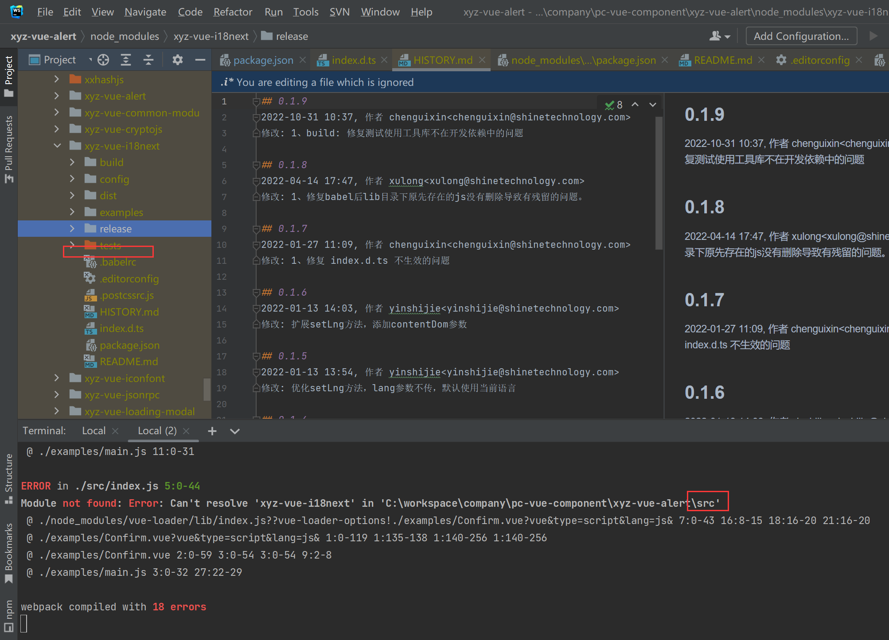
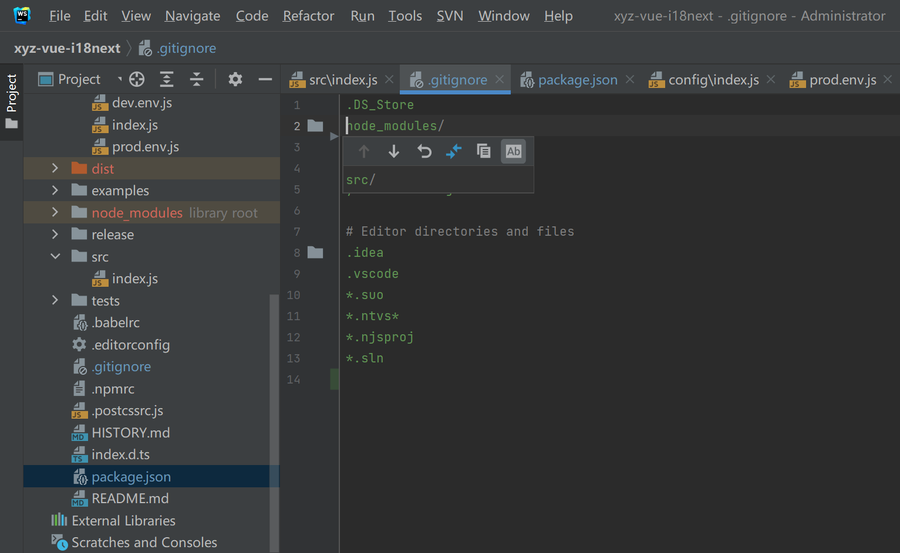

## 升级流程

### 1. `build/*`

覆盖原本的 build 文件夹，若原本该组件的脚手架不包含 `build/test` 文件夹，则更新后也不能包含 `build/text` 文件夹

### 2. `config/index.js`

若包含以下高亮行代码

```js{4}
module.exports = {
    dev: {
        // ...
        devtool: 'cheap-module-eval-source-map'
        // ...
    }
};
```

则需调整为：

```js{4}
module.exports = {
    dev: {
        // ...
        devtool: 'eval-cheap-module-source-map'
        // ...
    }
};
```

### 3. `.npmrc`

```text
node-linker=hoisted
strict-peer-dependencies=false
shamefully-hoist=true
child-concurrency=8
lockfile=false
```

### 4. `.babelrc`

```json
{
    "presets": [
        [
            "@babel/preset-env",
            {
                "modules": false,
                "targets": {
                    "browsers": ["> 1%", "last 2 versions", "not ie <= 8"]
                }
            }
        ]
    ],
    "plugins": ["transform-vue-jsx", "babel-plugin-syntax-dynamic-import"]
}
```

### 5. `package.json`

1. 若原本 main 入口为 `./lib/index.js`，则调整为 `src/index.js`
2. 更新 scripts 中 `dev` 为 `webpack serve --config build/webpack.dev.conf.js`
3. 更新 scripts 中 `build` 命令为 `node build/build.js`
4. 若原本 scripts 中无 `test` 命令，则无需新增该命令
5. 调整 `devDependencies` 为以下内容

```json{2,4,7,9-13,16-86}
{
    "name": "xyz-vue-loading-modal",
    "version": "0.1.24",
    "description": "基于bootstrap modal封装的loading组件",
    "author": "chenguixin<chenguixin@shinetechnology.com>",
    "homepage": "",
    "keywords": ["等待", "加载中", "业务界面模块"],
    "main": "src/index.js",
    "scripts": {
        "dev": "webpack serve --config build/webpack.dev.conf.js",
        "start": "npm run dev",
        "build": "node build/build.js",
        "test": "node build/test/test.js",
        "prepublishOnly": "node build/check-legal.js"
    },
    "devDependencies": {
        "@babel/cli": "7.17.6",
        "@babel/core": "7.18.13",
        "@babel/plugin-syntax-dynamic-import": "7.8.3",
        "@babel/plugin-syntax-jsx": "7.16.7",
        "@babel/preset-env": "7.18.10",
        "@babel/preset-stage-2": "7.8.3",
        "@soda/friendly-errors-webpack-plugin": "1.8.1",
        "@vue/compiler-sfc": "3.2.31",
        "async": "2.4.1",
        "autoprefixer": "10.4.8",
        "babel-helper-vue-jsx-merge-props": "2.0.3",
        "babel-loader": "8.2.2",
        "babel-plugin-import": "1.13.3",
        "babel-plugin-syntax-dynamic-import": "6.18.0",
        "babel-plugin-syntax-jsx": "6.18.0",
        "babel-plugin-transform-vue-jsx": "3.5.0",
        "chalk": "4.1.2",
        "clean-webpack-plugin": "4.0.0",
        "colorful": "2.0.3",
        "copy-webpack-plugin": "4.6.0",
        "cross-env": "7.0.3",
        "css-loader": "6.7.1",
        "css-minimizer-webpack-plugin": "4.0.0",
        "happypack": "5.0.1",
        "html-loader": "4.2.0",
        "html-webpack-plugin": "5.5.0",
        "lodash": "3.10.1",
        "mini-css-extract-plugin": "2.6.1",
        "node-notifier": "5.1.2",
        "ora": "1.2.0",
        "portfinder": "1.0.28",
        "postcss": "8.4.16",
        "postcss-import": "14.1.0",
        "postcss-loader": "7.0.1",
        "postcss-pxtorem": "6.0.0",
        "postcss-url": "10.1.3",
        "puppeteer": "18.2.1",
        "request": "2.88.2",
        "sass": "1.54.5",
        "sass-loader": "13.0.2",
        "semver": "7.3.7",
        "shelljs": "0.8.5",
        "speed-measure-webpack-plugin": "1.5.0",
        "style-loader": "1.3.0",
        "terser": "5.12.1",
        "terser-webpack-plugin": "5.3.1",
        "tmp": "0.2.1",
        "to-string-loader": "1.1.6",
        "vue": "2.6.14",
        "vue-loader": "15.10.0",
        "vue-style-loader": "4.1.0",
        "vue-template-compiler": "2.6.14",
        "webpack": "5.38.1",
        "webpack-bundle-analyzer": "4.5.0",
        "webpack-cli": "4.10.0",
        "webpack-dev-server": "4.10.0",
        "webpack-merge": "4.1.0",
        "webpack-parallel-uglify-plugin": "2.0.0",
        "webpackbar": "5.0.2",
        "xml-loader": "1.2.1",
        "xml2js": "0.1.14"
    },
    "engines": {
        "node": ">= 6.0.0",
        "npm": ">= 3.0.0"
    },
    "browserslist": ["> 1%", "last 2 versions", "not ie <= 8"],
    "assets": false
}
```

### 6. `.gitignore`

```text
.DS_Store
node_modules/
npm-debug.log*
yarn-debug.log*
yarn-error.log*

# Editor directories and files
.idea
.vscode
*.suo
*.ntvs*
*.njsproj
*.sln

# Ignore for publish
.babelrc
```

## QA

### 指定了 main 入口为 src 下，但引用这个包的地方缺少 src 文件夹？

-   问题详情
    

-   解决方案：排查 .gitignore 下是否包含`src/`目录，若包含，则在 npm publish 时会将 src 目录忽略，将该忽略规则删除即可
    
